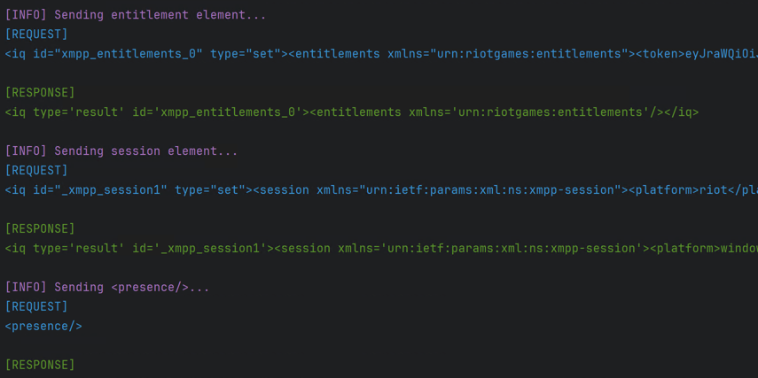
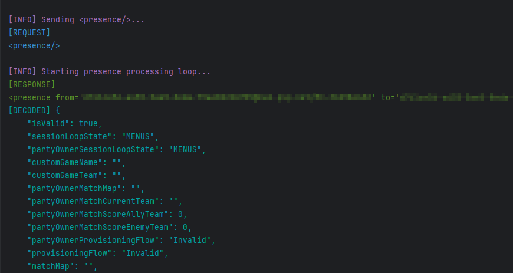

# RiotXMPP
RiotXMPP is a python client for connecting to the Riot/Valorant XMPP servers easily. 
This will handle the whole flow of connecting to the servers, authenticating the user, and begin logging the incoming XMPP presences of the
authenticated users friends. Currently, the client only prints out the received messages to the console but can be easily changed to log to a file, send presence updates, etc.
These features will eventually be added as this is still a work in progress. 

### Features
    - Automatic authentication to XMPP server when Valorant is running via local api endpoints
    - Ability to decode presence data

### Example code:

```python
from src.Handlers.RiotXMPP import RiotXMMPClient
from src.Handlers.Auth import ValorantAuth
import asyncio


async def main():
    # Get authentication information of logged-in user
    auth = ValorantAuth(auth_type="local")
    creds = auth.tokens

    client = RiotXMMPClient(
        credentials=creds,
        region=auth.user_info["region"],
        chat_host=auth.user_info["chat_host"],
        chat_port=auth.user_info["chat_port"],
        puuid=auth.user_info["puuid"],
    )

    # Establish the connection
    await client.connect()

    # Initiate the authentication flow
    await client.start_auth_flow()

    # # Don't start processing messages if client is not connected
    if client.connected is True:
        # Start the main loop to start processing presences and decoding them
        await client.process_presences(decode=True)


if __name__ == "__main__":
    # Run the loop using asyncio
    asyncio.run(main())


```


