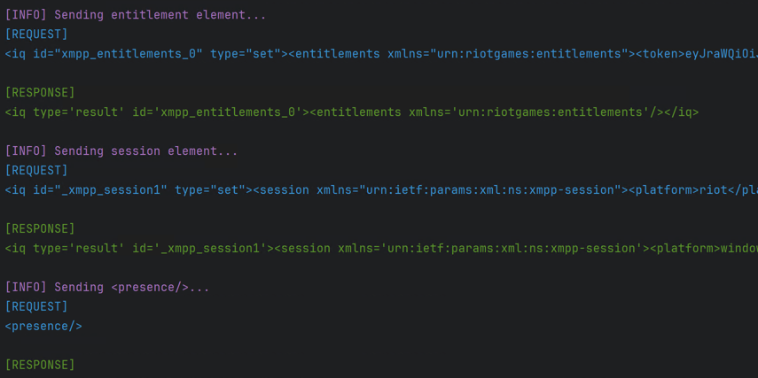

# RiotXMPP
RiotXMPP is a python client for connecting to the Riot/Valorant XMPP servers easily. 
This will handle the whole flow of connecting to the servers, authenticating the user, and begin logging the incoming XMPP presences of the
authenticated users friends. Currently, the client only prints out the received messages to the console but can be easily changed to log to a file, decode presences, send presence updates, etc.
These features will eventually be added as this is still a work in progress. 

### Example code:

```python
from src.RiotXMPP import RiotXMMPClient
import asyncio


async def main():
    creds = {
        "rso_token": "xxxxxxxx",
        "entitlements_token": "xxxxxxxx",
        "pas_token": "xxxxxxxx",
    }

    region = "na1"
    chat_host = "na2.chat.si.riotgames.com"
    chat_port = 5223
    puuid = "xxxxxxxx"

    client = RiotXMMPClient(
        credentials=creds,
        region=region,
        chat_host=chat_host,
        chat_port=chat_port,
        puuid=puuid,
    )

    # Establish the connection
    await client.connect()

    # Initiate the authentication flow
    await client.start_auth_flow()

    # Don't start processing messages if client not connected
    if client.connected is True:
        # Start the main loop to start processing presences
        await client.process_presences()


if __name__ == "__main__":
    # Run the loop using asyncio
    asyncio.run(main())


```

